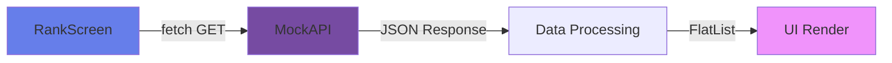

# 🎓 FunQuiz Academy
### Aplikasi Kuis Mobile Interaktif | React Native & Expo

<div align="center">


**Aplikasi kuis mobile cross-platform yang interaktif dan dinamis, dibangun dari nol dengan React Native**

[Demo](#-pratinjau-aplikasi) • [Fitur](#-fitur-utama) • [Teknologi](#️-teknologi--konsep) • [Instalasi](#-instalasi)

</div>

---

## 📋 Tentang Proyek

> **⚠️ PENTING:** Ini **BUKAN** sekadar "UI clone"!

FunQuiz Academy adalah **aplikasi fungsional lengkap** yang mendemonstrasikan pemahaman mendalam tentang konsep-konsep inti dan lanjutan React Native, termasuk:

<table>
<tr>
<td width="50%">

✅ **State Management Kompleks**
- React Hooks (useState, useEffect, useRef)
- Custom Global State (useQuiz hook)
- Data persisten dengan AsyncStorage

</td>
<td width="50%">

✅ **Fitur Lanjutan**
- Integrasi API eksternal (fetch)
- Navigasi dinamis & cerdas
- Styling kustom tingkat lanjut
- Animasi & UI interaktif

</td>
</tr>
</table>

---

## 📸 Pratinjau Aplikasi

<div align="center">

### 🎯 Onboarding Flow
<table>
<tr>
<td align="center" width="33%">

<br><b>Layar Sambutan</b>
</td>
<td align="center" width="33%">

<br><b>Layar Login</b>
</td>
<td align="center" width="33%">

<br><b>Layar Utama</b>
</td>
</tr>
</table>

### 🎮 Quiz Experience
<table>
<tr>
<td align="center" width="33%">

<br><b>Layar Kuis</b>
</td>
<td align="center" width="33%">

<br><b>Jawaban Benar</b>
</td>
<td align="center" width="33%">

<br><b>Papan Peringkat</b>
</td>
</tr>
</table>

</div>

> 💡 **Tip:** Ganti URL `https://placehold.co/...` dengan screenshot aplikasi Anda!

---

## 🚀 Fitur Utama

### 1️⃣ **Alur Onboarding & Navigasi Cerdas**

```typescript
// Navigasi otomatis berdasarkan status pengguna
const checkInitialRoute = async () => {
  const isFirstTime = await AsyncStorage.getItem('isFirstTimeUser');
  return isFirstTime ? 'Welcome' : 'Home';
};
```

<details>
<summary><b>📝 Fitur Detail</b></summary>

- ✨ **Pemuatan Font Kustom** - Gilroy (Medium, SemiBold, Bold)
- 🎬 **Manajemen Splash Screen** - Mencegah layout shift
- 🧭 **Navigasi Cerdas** - Deteksi pengguna baru/lama otomatis
- 📱 **Stack Navigation** - Alur layar terstruktur

</details>

---

### 2️⃣ **Layar Sambutan & Login**

<table>
<tr>
<td width="50%">

**🎨 Design Highlights:**
- Gradient background dengan `expo-linear-gradient`
- Ilustrasi dekoratif (koin, buku, toga)
- Layout absolute positioning

</td>
<td width="50%">

**⚡ Fungsionalitas:**
- Dual UI state (Awal → Input Nama)
- Form validation
- User initialization
- Replace navigation (no back)

</td>
</tr>
</table>

---

### 3️⃣ **Layar Utama (Home Screen)**

> **Real-time data dengan useFocusEffect hook**

| Fitur | Deskripsi |
|-------|-----------|
| 👋 **Personalisasi** | Sapaan dengan nama & total koin user |
| 🎠 **Carousel Kategori** | ScrollView horizontal dengan pagination dots |
| 📊 **Progress Tracking** | Custom CircularProgress component (SVG) |
| 🎯 **Quiz Cards** | 4 kategori + "Other Quiz" card |
| 🧭 **Bottom Nav** | Custom navbar dengan tombol aktif |

```javascript
// Pagination dots yang responsif
onScroll={(e) => {
  const slideIndex = Math.round(e.nativeEvent.contentOffset.x / width);
  setActiveSlideIndex(slideIndex);
}}
scrollEventThrottle={200}
```

---

### 4️⃣ **Layar Kuis - Fitur Paling Kompleks** 🌟

<div align="center">

#### 🎯 Header Kustom dengan Absolute Layout

```
┌─────────────────────────────────┐
│  [X]    ⏰ 09 SEC    💰 1,250  │  ← Position Absolute
└─────────────────────────────────┘
```

</div>

#### ⏱️ **Timer 10 Detik & Progress Ring**

- **React Hooks Orchestra:**
  - `useEffect` - Timer lifecycle management
  - `useRef` - Interval ID storage
  - `useState` - Countdown state
  
- **Visual Magic:**
  ```jsx
  <CircularProgress
    duration={950}              // Smooth animation
    transform={[{ scaleX: -1 }]} // Counter-clockwise
  />
  ```

#### 🎯 **Alur Jawaban Inline (Tanpa Layar Terpisah)**

<table>
<tr>
<td width="50%">

**✅ Jawaban Benar:**
- Tombol benar → putih + teks hijau ✓
- Tombol salah → disembunyikan
- Footer: "+10 Coins"

</td>
<td width="50%">

**❌ Jawaban Salah:**
- Tombol dipilih → merah ✗
- Tombol benar → hijau (tetap tampil)
- Footer: "Oops! Wrong Answer"

</td>
</tr>
</table>

#### 🎨 **Tombol 3D Kustom (AnswerButton)**

```jsx
// Teknik double-view untuk efek 3D
<View style={{ bottom: 6 }}>        // Shadow layer
  <View style={styles.topLayer}>    // Button layer
    <Text>Answer Option</Text>
  </View>
</View>
```

> 🎯 State-driven UI dengan fungsi `getAnswerState()` untuk styling dinamis

---

### 5️⃣ **Layar Peringkat - Integrasi API** 🏆

<div align="center">



</div>

**📡 API Integration:**
- Endpoint: `https://690ef118bd0fefc30a062389.mockapi.io/leaderboard`
- Loading state dengan `ActivityIndicator`
- Error handling yang user-friendly
- Avatar loading dari URL dinamis

**🎨 UI Features:**
- Data sorting (skor tertinggi)
- FlatList performance optimization
- Konsistensi design dengan QuizScreen
- Coin icon display

---

## 🛠️ Teknologi & Konsep

### 🏗️ **Core Technologies**

```
┌─────────────────────────────────────────────┐
│  React Native + Expo Managed Workflow       │
│  ├─ Cross-platform (iOS & Android)          │
│  ├─ TypeScript untuk Type Safety            │
│  └─ Modern JavaScript (ES6+)                │
└─────────────────────────────────────────────┘
```

### 🎣 **State Management**

<table>
<tr>
<td width="33%" align="center">

**React Hooks**
```typescript
useState
useEffect
useRef
useCallback
```

</td>
<td width="33%" align="center">

**Custom Hooks**
```typescript
useQuiz()
useFocusEffect()
```

</td>
<td width="33%" align="center">

**Storage**
```typescript
AsyncStorage
fetch API
```

</td>
</tr>
</table>

### 📚 **Libraries & Tools**

| Library | Purpose | Usage |
|---------|---------|-------|
| `@react-navigation/stack` | 🧭 Navigation | Screen flow management |
| `expo-linear-gradient` | 🎨 Visuals | Gradient backgrounds |
| `expo-font` | 🔤 Typography | Custom font loading |
| `react-native-svg` | 🎭 Graphics | Custom progress ring |
| `react-native-circular-progress` | ⏱️ Animation | Timer visualization |
| `AsyncStorage` | 💾 Storage | Persistent user data |

### 🎨 **Advanced Styling Techniques**

- ✅ Flexbox layouts yang kompleks
- ✅ Absolute positioning untuk presisi
- ✅ Custom 3D button effects
- ✅ Transform & animation properties
- ✅ Responsive design dengan dimensions

---

## 📁 Struktur Folder

```
FunQuizAcademy/
│
├── 📂 assets/
│   ├── 🔤 fonts/              # Gilroy (Medium, SemiBold, Bold)
│   ├── 🖼️ images/
│   │   ├── content/          # Quiz banners
│   │   ├── icons/            # UI icons
│   │   └── illustrations/    # Onboarding images
│   └── 🎯 quiz-image/        # Question images
│
├── 📂 src/
│   ├── 🧩 components/        # Reusable UI (AnswerButton, CircularProgress)
│   ├── 🎨 constants/         # Global config (colors, images, fonts)
│   ├── 📊 data/              # Static data (quizData.ts)
│   ├── 🎣 hooks/             # Custom hooks (useQuiz.ts)
│   ├── 🧭 navigation/        # Navigation setup (AppNavigator.tsx)
│   ├── 📱 screens/           # Main screens (Home, Quiz, Rank, etc.)
│   ├── 📝 types/             # TypeScript definitions
│   └── 🔧 utils/             # Helper functions (storage.ts)
│
├── 🚀 App.tsx                # Entry point (font loading & navigator)
├── 📦 package.json
└── 📖 README.md              # You are here!
```

---

## 🚀 Instalasi

### Prerequisites

```bash
# Node.js (v14 or higher)
node --version

# npm atau yarn
npm --version
```

### Setup Project

```bash
# 1. Clone repository
git clone https://github.com/username/FunQuizAcademy.git
cd FunQuizAcademy

# 2. Install dependencies
npm install
# atau
yarn install

# 3. Start Expo development server
npx expo start

# 4. Scan QR code dengan Expo Go (iOS/Android)
```

---

## 🎯 Kriteria Proyek Terpenuhi

<div align="center">

| # | Kriteria | Status | Detail |
|---|----------|--------|--------|
| 1 | **React Native Foundation** | ✅ | Core components & layouts |
| 2 | **State Management** | ✅ | Hooks + Custom Hook (useQuiz) |
| 3 | **Navigation** | ✅ | Stack Navigator + Conditional routing |
| 4 | **Styling** | ✅ | Advanced custom styles + 3D effects |
| 5 | **Data Persistence** | ✅ | AsyncStorage integration |
| 6 | **API Integration** | ✅ | fetch API di RankScreen |

</div>

---

## 📝 TODO & Future Improvements

- [ ] Implementasi autentikasi Google yang sebenarnya
- [ ] Tambah kategori kuis lebih banyak
- [ ] Leaderboard real-time dengan WebSocket
- [ ] Animasi transisi antar layar
- [ ] Dark mode support
- [ ] Multi-language support (i18n)
- [ ] Unit testing dengan Jest
- [ ] E2E testing dengan Detox

---

## 👨‍💻 Developer

<div align="center">

**Made with ❤️ and ☕ by [Your Name]**

[](https://github.com/username)
[](https://linkedin.com/in/username)
[](https://yourportfolio.com)

</div>

---

## 📄 License

This project is licensed under the MIT License - see the [LICENSE](LICENSE) file for details.

---

<div align="center">

### ⭐ Jika proyek ini bermanfaat, jangan lupa beri Star!

**[⬆ Back to Top](#-funquiz-academy)**

</div>
